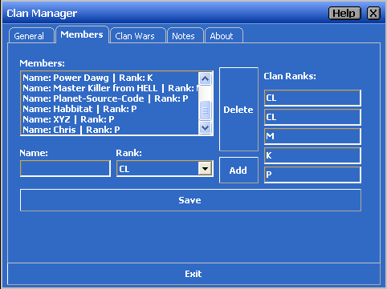



## Clan Manager

### Description

Clan Manager is an application to save all your Clan Information from a Game Clan.

Don't expect too much of it cause I'm only 12 years old...
 
### More Info
 

             |
---                |---
**Submitted On**   |2004-11-22 23:22:38
**By**             |[Jurek Rutkowski](https://github.com/Planet-Source-Code/PSCIndex/blob/master/ByAuthor/jurek-rutkowski.md)
**Level**          |Beginner
**User Rating**    |3.7 (11 globes from 3 users)
**Compatibility**  |VB 6\.0
**Category**       |[Complete Applications](https://github.com/Planet-Source-Code/PSCIndex/blob/master/ByCategory/complete-applications__1-27.md)
**World**          |[Visual Basic](https://github.com/Planet-Source-Code/PSCIndex/blob/master/ByWorld/visual-basic.md)
**Archive File**   |[Clan\_Manag18218311252004\.zip](https://github.com/Planet-Source-Code/jurek-rutkowski-clan-manager__1-57416/archive/master.zip)

### API Declarations

The isButton, MacButton, XP_Progressbar and the XTab.ocx are not mine! They are created by other people and the original source from the files are also published here at PSC.com.

